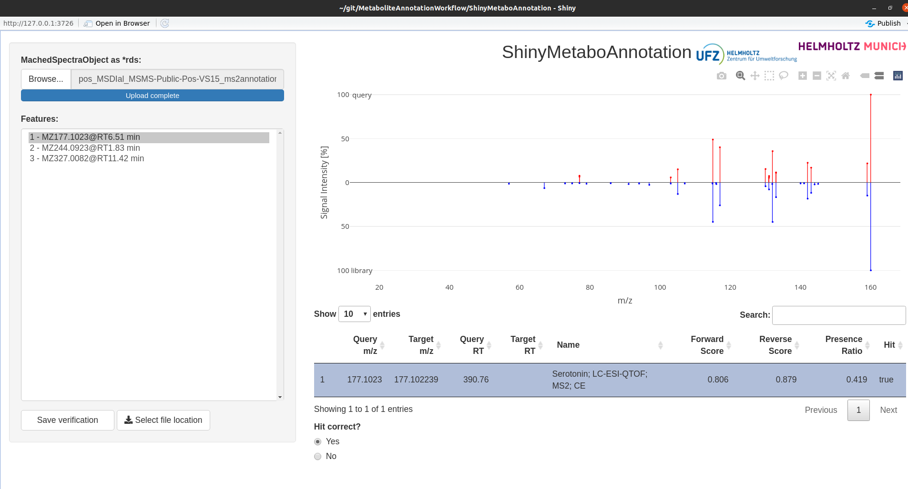

# MetaboliteAnnotationWorkflow
An R script for the annotation of small-molecule LC-MS data

This repoistory contains full workflow application for annotating a full signal intesity matrix recieved from e.g. slaw (see https://github.com/zamboni-lab/SLAW for further details) 
with MS1/MS2 annotation with the MetaboAnnotation package (see https://github.com/rformassspectrometry/MetaboAnnotation).

## Usage

Example workflow can be found in `MetaboliteAnnotationWorkflow.R` and run on command line as:

```Rscript MetaboliteAnnotationWorkflow.R settings.yaml```

## Input Parameter

All required input parameters are stored in a `yaml-file`. See `test_input/settings.yaml` for a example settingsfile.
Following parameters need to be provided:
 - `cores`: Defining on how many cores the calculatation shall be performed.
 - `tolerance_MS1` and `tolerance_MS2`: Defining the absolute allowed tolerance for annotation.
 - `ppm_MS1` and `ppm_MS2`: Defining the relative allowed tolerance.
 - `adducts_pos` and `adducts_neg` which are calculated for MS1 annotation.
 - `dp_tresh` the dot product score threshold applied for annotation.
 - `int_tresh` defining the relative intensity threshold which will be removed from the MS2 query sepctra.
 - `toleranceRT_MS1` and `toleranceRT_MS2` defining the window in retention time in seconds used for annotation.
 - `output_dir` which is defining the directory to store the result data.
 -  `save_rds` a logical (TRUE/FALSE) defining if all calculated objects shall be stored. These can be easy loaded again into e.g. an R session.
 -  `save_tsv` a logical (TRUE/FALSE) defining if match results should be provided as tsv.


## Input Data

All required input variables are stored in a `yaml-file`. See `test_input/settings.yaml` for a example settingsfile.
Here, we define the paths for following input files:
 - The slaw output containing the datamatrix and fused mgf file to use for both ionization modes
 - `studydesign_pos` and `studydesign_neg`: A `*.csv` file containing the Sample metadata used to be stored in the `colData` of the final `SummarizedExperiment` (optional if parameter `samplegroup=TRUE`).
 - Input library directories (positive and negative mode) containg the MS1 annotation lists. Two different directories can be provided distiguishing between inhouse-data `inhouse` and extern data `ext`. For inhouse data, an additional retention time matching will be performed. The `*.csv` files should contain the rows:

| id | name | formula | exact_mass | rt |
| - | - | - | - | - |

While retention time is only needed for the inhouse file.

- Input library directories (positive and negative mode) containing the MS2 spectral libraries. Following input formats are supported: 
    - `*.mb` as MassBank record file 
    - `*.msp` as MS2 MSP file
    - `*.rds` a Spectra object containing the library spectra

## Output Data

In the output directory following directories will be created:
 - `Annotation_MS1_external`: Containing the result files of the MS1 annotation without retention time.
 - `Annotation_MS1_inhouse`: Containing the result files of the MS1 annotation with retention time.
 - `Annotation_MS2_external`: Containing the result files of the MS2 annotation without retention time.
 - `Annotation_MS2_inhouse`: Containing the result files of the MS2 annotation with retention time.
 - `QFeatures_MS1`: Containing `*.rds` files with the QFeatures SummarizedExperiment objects.

## Evaluate Data

 - If the `matchedSpectra` Objects are stored (settings parameter `save_rds= TRUE`), these can be reviewed by using the command:

```Rscript ShinyMetaboAnnotation/app.R [matchedObject.rds]```

The used MatchedObject can be either defined by the commandline argument or later loaded in later in the Shiny application.
Alternatively, the application can be opened in RStudio and using the `run application` button in the top of the source.



By clicking on the `Browse...` button, a rds file containing a MatchedSpectra Object can be loaded.

The side panel contains all features with matches revealed from the MS2 query data, defined by mass and retention time. By clicking on the side panel entry, the spectra will be loaded. The table on the bottom contains all matches revealed. Note that the library spectra will only be loaded if clicking on the table row for selection.

On the bottom, you can select if you verify the match or if it is a false positive. 

If you have finalized your selection either click on the `save verification` button if you have uploaded the file by commandline. This will generate a new MatchedSpectra Object only containing the TRUE annotations in a `*_verified.rds` file.

If you have uploaded the Object though the `Browse...` button, please note that you should use the `Select file location`button for stroage.

